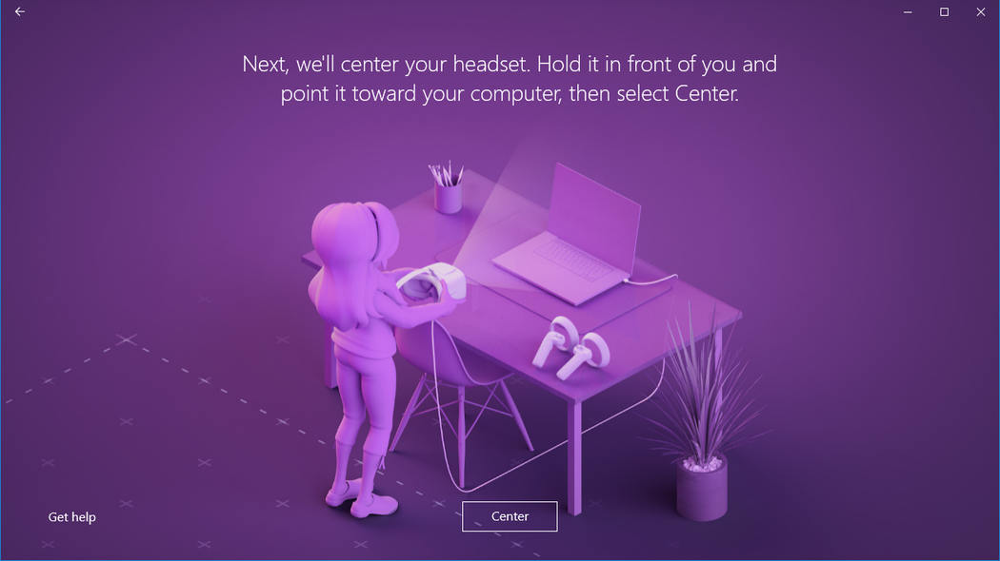
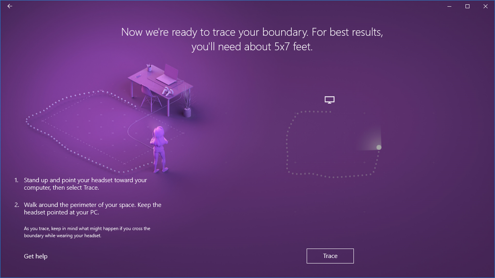
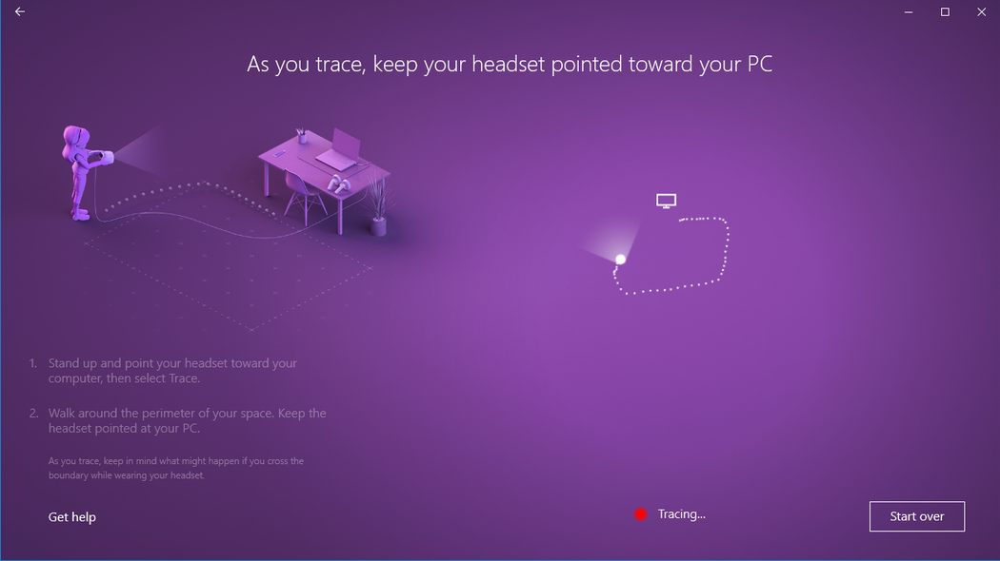
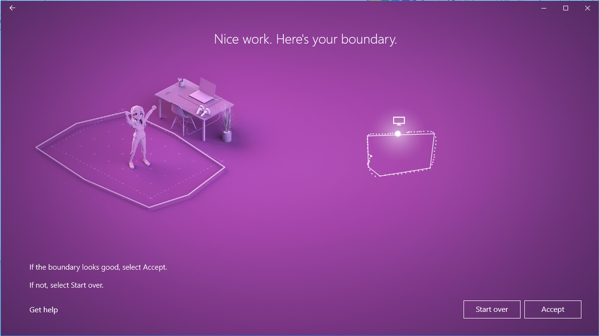

# Set up Windows Mixed Reality

## Set up your motion controllers

The next step is to set up your motion controllers. Windows Mixed Reality motion controllers require Bluetooth 4.0. If your PC does not have onboard Bluetooth, you will need to plugin a USB Bluetooth dongle that supports Bluetooth 4.0 to enable your motion controllers.

**Common issues:**
1. Verify you have one and only one Bluetooth radio active on your PC. If you have more than one Bluetooth radio, you’ll need to disable the other radios in Device Manager.
2. Place your Bluetooth dongle in a port that has a clear line of sight to your controllers, and far from plugged in USB 3.0 devices. USB 3.0 is known to have RF interference with Bluetooth (read [this paper](https://www.intel.com/content/dam/www/public/us/en/documents/white-papers/usb3-frequency-interference-paper.pdf) from Intel for more details). USB 2.0 ports may work better for your Bluetooth dongle.
3. Make sure your Bluetooth dongle is not plugged into a USB port adjacent to your HMD's USB cable. The HMD's cable has been known to cause interference with Bluetooth dongles as well. Plug the dongle into the front USB port on your PC for best results.
4. For notebook ensure WiFi is connected to 5GHz band for best experience (click wireless network icon bottom right tray, select properties for the network you are connected). Notebooks that are designed to share a 2.4GHz antenna for Bluetooth and WiFi connectivity are most likely to see data congestion in the form of slow network speeds or poor tracking performance for motion controllers
5. Your motion controllers will receive new software updates from Microsoft on a regular basis. The controllers will show an alternating pattern of flashing lights when they receive these new software updates. This is normal. You will want to wait until the controllers complete the software upgrade, indicated by a vibration and the replacement of the alternating flash pattern with a constant light emitted from the controllers, in order to use the controllers
6. You may be told to "Put on the headset and use the thumbstick to teleport" before the controllers finish the update process. The controllers will not be visible or usable until the update is completed. Most updates occur within 2mins, but it's possible the occasional update is as long as ~10mins. Please wait for the update to complete to proceed to the next step

### Get familiar with your motion controllers

### Pair your motion controllers with your PC

Power on controllers by pressing the Windows button for 2 seconds until LEDs light up.

Remove the battery cover from your controllers and find the small pairing button at the edge of the controller. Per the instructions in Mixed Reality Portal, hold this button down to pair with your PC

### Pairing successful

Once your controllers are paired successfully, you will see two green checkmarks for the left and right controllers

You may see a message in the bottom right hand corner of your screen as the firmware on your controllers get updated. While this is happening, you can advance to the next step in the tutorial, but please don't turn off your controllers.

Once controller firmware update is complete it will restart and re-connect to host PC. LEDs will be solid on and bright.

## Set up your room boundary

The next step is to choose a room scale or desk scale experience:

**Option 1: Set me up for all experiences ("room scale")** will allow you to walk around the room and is the most immersive mixed reality experience. We recommend you at clear at least 5 foot x 7 foot (1.5 meters x 2 meters) of space for mixed reality.

**Option 2: Set me up for seated and standing experience ("desk scale")** experience will work at your desk. It's a good option if you don't have a lot of room in your space. It also means that you will be using your headset without a boundary. You'll need to stay in one place, as you'll have no boundary to help you avoid physical obstacles. Also, some apps and games may be designed to be used with a boundary, so they might not work as intended.

Choose an option.

### Option 1: Set me up for all experiences ("room scale")

Soon, your room will become a virtual world where you can walk around and interact! Stand up and clear some space in your room for running mixed reality (e.g. clear some floor space and move your chair to the side of the room). We recommend you at clear at least 5 foot x 7 foot (1.5 meters x 2 meters) of space for mixed reality.

Make sure your space is clear.

Center your headset.

Trace your boundary.

Keep your headset pointed toward your PC.

Here's your boundary.

### Option 2: Set me up for seated and standing experience ("desk scale")

There are no additional steps required if you choose this option.

## Set up speech

You can enable Cortana commands inside of mixed reality. This allows you to use speech commands inside of mixed reality to teleport, open apps, and do other things. You'll learn more about this in the [learn mixed reality](learn-mixed-reality.md) chapter.

Mixed reality is better with speech

## Setting up your audio headset

Unless you purchased a Samsung HMD Odyssey (which has integrated AKG headphones and an integrated dual microphone array), you will need to get an audio headset (that has both mic AND headphones) and plug that into your HMD's 3.5mm audio jack. The 3.5mm audio headset jack for your HMD will - depending on the HMD model - be located either on the underside of the HMD visor or at the end of a short audio cable coming out of the HMD visor.

## See also

* [Troubleshooting > Installation and Setup](troubleshooting-windows-mixed-reality.md#installation-and-setup)
* [Learn mixed reality](learn-mixed-reality.md)
